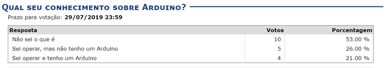
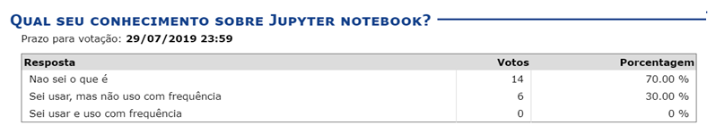

# DCO1005 - PRINCÍPIOS DE TELECOMUNICAÇÕES 

## Contexto problemático
- Aplicação de Internet das Coisas (IoT) utilizando modulação AM e/ou FM com Arduino

## Projetos temáticos pra iniciativas de ensino ativo para a disciplina de Princípios de Telecomunicações da UFRN

### Equipes:
- **Equipe 1:**
   - Membro 1 (Líder)
   - 
- **Equipe 2:**
   - Membro 1 (Líder)
   - 
- **Equipe 3:**
   - Membro 1 (Líder)
   - 
- **Equipe 4:**
   - Membro 1 (Líder)
   - 
- **Equipe 5:**
   - Membro 1 (Líder)
   - 

## Pesquisas

- Quem tem arduino
   - HELLEN OLIVEIRA LUNGA DA SILVA
   - DANIEL BARBOSA DE ASSIS
   - LUCA LISBOA KRAUSE ARAUJO DOS SANTOS
   - DAVI ALVES FEITOSA DE SOUZA
- Quem sabe operar Arduino
   - ARTHUR DA SILVA BERTULEZA
   - CÉSAR JULIANO ODJA ANDRADE
   - JOAO VITOR DE SOUZA LOPES 
   - VITOR ARAUJO CAMARA
   - JOAO PAULO NASCIMENTO DOS SANTOS

- Jupyter notebook
   - ARTHUR DA SILVA BERTULEZA
   - VINICIUS CÉSAR BEZERRA DE OLIVEIRA 
   - CÉSAR JULIANO ODJA ANDRADE	
   - KALINE DA SILVA MARQUES	
   - DANIEL BARBOSA DE ASSIS
   - LUCA LISBOA KRAUSE ARAUJO DOS SANTOS

## Etapas

### 1. Brainstorm aplicações IoT com AM e/ou FM (sábado, 17/10/2019)
- Pesquisar aplicações interessantes que possam ser realizadas com modulação AM ou FM
- Enumerar aplicações para uma reunião de Brainstorm 
- Cada equipe apresentará no mínimo 5 ideis em uma apresentação de 10 minutos
- Guardar todo tipo de informação sobre a ideia (link, artigos, notícias). Fazer uma apresentação bem referenciada.

### 2. Tecnologias e habilitadores
- Pesquisa de preços de módulos Arduino 
- Pesquisa de preços de conjunto de cabos
- Pesquisa de preços de placa protoboard
- Pesquisa de preços de módulo AM para Arduino
- Pesquisa de preços de módulo FM para Arduino

### 3. Projetos/Cronograma geral/Alocação de equipes
### 4. Metas de aprendizado
### 5. Cronograma de execução
